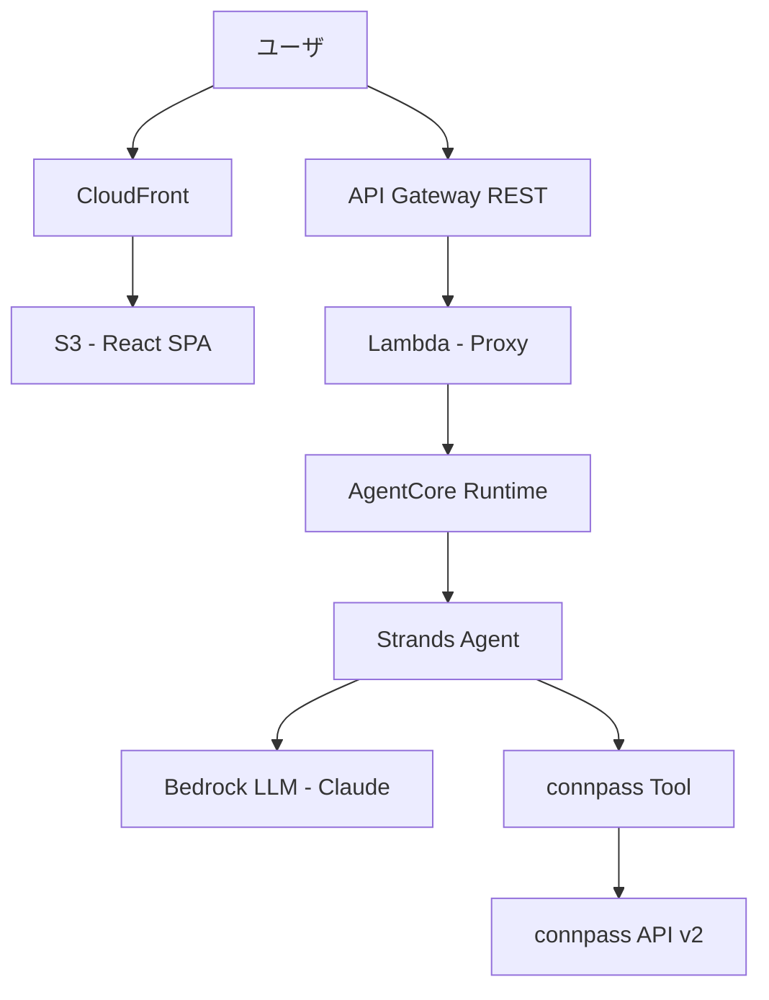
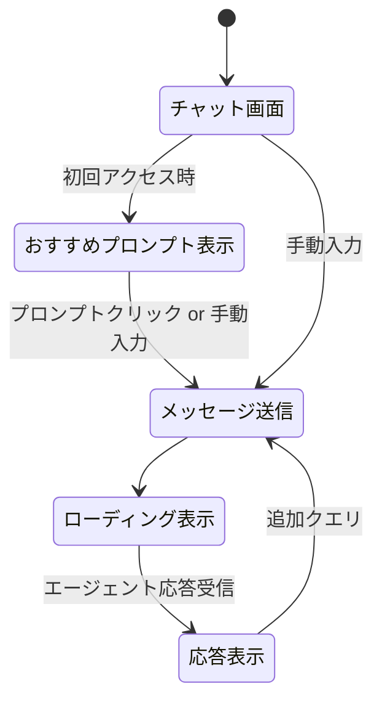
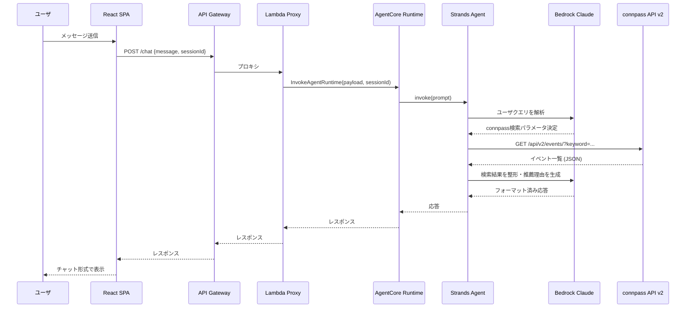

# 技術設計書

## 概要

confeeは、Strands Agents SDKで構築されたAIエージェントをAmazon Bedrock AgentCore Runtime上にデプロイし、connpass API v2からカンファレンス情報を取得・推薦するシステムである。フロントエンドはReact SPAとしてS3 + CloudFrontでホスティングし、API Gateway + Lambdaを介してAgentCore Runtimeと通信する。MVPとして最低限の構成で構築する。

## 要件マッピング

### 設計コンポーネントのトレーサビリティ
- **Strands Agent + connpass Tool** → 要件1（自然言語検索）、要件2（あいまいクエリ推薦）、要件3（Compass API連携）
- **エージェント応答フォーマッタ（システムプロンプト）** → 要件4（構造化された提示）
- **React チャットUI** → 要件5（チャットインターフェース）、要件7（おすすめプロンプト表示）
- **AgentCore Runtime + AWS インフラ** → 要件6（AWSデプロイ）
- **AgentCore Runtime セッション + API Gateway** → 要件8（非機能要件）

### ユーザストーリーカバレッジ
- 要件1・2: Strands Agentがユーザの自然言語入力を解釈し、connpass APIツールを呼び出して結果を推論・整形
- 要件3: カスタムツール`search_connpass`がconnpass API v2を直接呼び出し
- 要件4: システムプロンプトでエージェントの出力フォーマットを制御
- 要件5: React SPAのチャットUIでメッセージ送受信・履歴表示
- 要件6: AgentCore Runtime + S3/CloudFront + API Gateway でAWS上に完結
- 要件7: フロントエンドでおすすめプロンプトをクリック可能チップとして表示
- 要件8: AgentCore Runtimeのマネージドスケーリング + API Gatewayのスロットリング

## アーキテクチャ



### 技術スタック

| レイヤー | 技術 | 理由 |
|---------|------|------|
| **フロントエンド** | React + TypeScript + Tailwind CSS | MVPとして十分な機能、軽量 |
| **ホスティング** | S3 + CloudFront | 静的サイト配信、低コスト |
| **APIプロキシ** | API Gateway + Lambda (Python) | AgentCore RuntimeへのSigV4認証を代行 |
| **エージェント** | Strands Agents SDK (Python) | AWSネイティブ、Bedrock統合が容易 |
| **LLM** | Amazon Bedrock (Claude Sonnet) | 日本語対応、推論能力が高い |
| **エージェントホスティング** | Bedrock AgentCore Runtime | サーバーレス、セッション分離、マネージドスケーリング |
| **外部API** | connpass API v2 | 技術カンファレンス情報の取得元 |
| **IaC** | AWS CDK (TypeScript) | インフラのコード管理 |

### アーキテクチャ判断根拠

- **AgentCore Gateway を使わない理由**: MVPではconnpass APIのみをツールとして利用するため、Strands Agentのカスタムツールとして直接実装する方がシンプル。Gateway は複数ツール/複数APIを統合管理する場合に有効であり、現時点ではオーバースペック
- **AgentCore Memory を使わない理由**: MVPではセッション内の会話継続のみ必要。AgentCore Runtimeのセッション機能（microVM内で最大8時間、15分アイドルタイムアウト）で十分。長期記憶が必要になった場合に導入を検討
- **API Gateway + Lambda を挟む理由**: AgentCore RuntimeへのアクセスにはSigV4署名が必要。フロントエンドから直接呼び出すにはCognitoが必要になるが、MVPではLambdaプロキシの方がシンプル

### 画面遷移



### データフロー

#### 主要ユーザフロー: カンファレンス検索



## コンポーネントとインターフェース

### バックエンドサービス

```python
# tools/search_connpass.py
@tool
def search_connpass(
    keyword: str = "",
    keyword_or: str = "",
    ym: str = "",
    ymd: str = "",
    prefecture: str = "",
    order: int = 2,
    count: int = 10,
    tool_context: ToolContext = None,
) -> dict:
    """connpass API v2からイベントを検索する"""
    ...

# agent.py
class ConfeeAgent:
    def create_agent(self) -> Agent:
        """Strands Agentを生成する"""
        ...

    def invoke(self, prompt: str, session_id: str) -> dict:
        """ユーザプロンプトを処理し応答を返す"""
        ...
```

```python
# lambda/handler.py
def handler(event: dict, context) -> dict:
    """API GatewayからのリクエストをAgentCore Runtimeに転送する"""
    ...
```

### フロントエンドコンポーネント

| コンポーネント | 責務 | Props/State概要 |
|--------------|------|----------------|
| `App` | アプリケーションルート | sessionId state |
| `ChatContainer` | チャット画面全体のレイアウト | messages[], isLoading |
| `MessageList` | メッセージ一覧の表示 | messages[] |
| `MessageBubble` | 個別メッセージの表示 | message, role |
| `ChatInput` | テキスト入力・送信フォーム | onSend callback |
| `SuggestedPrompts` | おすすめプロンプトチップ | prompts[], onSelect, visible |
| `LoadingIndicator` | 処理中インジケータ | isVisible |
| `ConferenceCard` | カンファレンス情報のカード表示 | conference data |

### APIエンドポイント

| メソッド | ルート | 目的 | 認証 | ステータスコード |
|---------|-------|------|------|----------------|
| POST | `/chat` | エージェントにメッセージを送信 | 不要（MVP） | 200, 400, 500, 503 |
| GET | `/health` | ヘルスチェック | 不要 | 200 |

#### POST /chat リクエスト/レスポンス

```json
// リクエスト
{
  "message": "TypeScriptのカンファレンスある？",
  "session_id": "uuid-string-at-least-33-chars"
}

// レスポンス
{
  "response": "エージェントの応答テキスト（Markdown形式）",
  "session_id": "uuid-string-at-least-33-chars"
}
```

## データモデル

### ドメインエンティティ

1. **ChatMessage**: ユーザとエージェント間のメッセージ（フロントエンド管理）
2. **ConnpassEvent**: connpass API v2から取得したイベント情報
3. **SuggestedPrompt**: おすすめプロンプトの定義

### データモデル定義

```typescript
// フロントエンド側の型定義

interface ChatMessage {
  id: string;
  role: "user" | "assistant";
  content: string;
  timestamp: Date;
}

interface ConnpassEvent {
  id: number;
  title: string;
  catch: string | null;
  description: string | null;
  url: string;
  started_at: string | null;
  ended_at: string | null;
  place: string | null;
  address: string | null;
  limit: number | null;
  accepted: number;
  waiting: number;
  open_status: "preopen" | "open" | "close" | "cancelled";
  group: {
    id: number;
    title: string;
    url: string;
  } | null;
}

interface SuggestedPrompt {
  id: string;
  label: string;
  prompt: string;
  category: "keyword" | "vague";
}
```

```python
# connpassツールのレスポンス型（Python dataclass）

@dataclass
class ConnpassEvent:
    id: int
    title: str
    catch: str | None
    url: str
    started_at: str | None
    ended_at: str | None
    place: str | None
    address: str | None
    accepted: int
    waiting: int
    limit: int | None
    open_status: str

@dataclass
class ConnpassSearchResult:
    results_returned: int
    results_available: int
    events: list[ConnpassEvent]
```

### データベーススキーマ

MVPではデータベースを使用しない。会話履歴はAgentCore Runtimeのセッション内メモリとフロントエンドのローカルステートで管理する。

## エラーハンドリング

| エラー種別 | 発生箇所 | 対処 |
|-----------|---------|------|
| connpass API タイムアウト | connpassツール | 5秒タイムアウト設定、ユーザにリトライを促すメッセージ |
| connpass API エラー (4xx/5xx) | connpassツール | エラー内容をエージェントに返し、ユーザにフレンドリーなメッセージを生成 |
| connpass API レート制限 (429) | connpassツール | 1秒間隔の遵守、超過時はエラーメッセージ |
| AgentCore Runtime エラー | Lambda Proxy | 503 Service Unavailable を返す |
| LLM呼び出し失敗 | Strands Agent | エージェント内部でリトライ、失敗時はエラー応答 |
| セッションタイムアウト | AgentCore Runtime | 新規セッションを自動生成（フロントエンド側） |

## セキュリティ考慮事項

- connpass APIキーは AWS Secrets Manager で管理し、AgentCore Runtime の環境変数経由で注入
- API Gatewayでリクエストサイズ制限（10KB）とスロットリング（秒間10リクエスト）を設定
- フロントエンドからAgentCore Runtimeへの直接アクセスは不可（Lambda Proxyで分離）
- CORS設定でCloudFrontドメインのみ許可

## パフォーマンスとスケーラビリティ

### パフォーマンス目標（MVP）

| メトリクス | 目標 | 備考 |
|-----------|------|------|
| 応答時間（E2E） | < 10秒 | LLM推論 + connpass API呼び出し含む |
| connpass API呼び出し | < 3秒 | タイムアウト5秒 |
| 同時ユーザ数 | 数名程度 | MVP要件 |

### スケーラビリティ

- AgentCore Runtimeがセッション単位でmicroVMを自動スケーリング
- API GatewayとLambdaもリクエスト数に応じて自動スケーリング
- MVP後の拡張時にCloudFrontキャッシュやLambda Provisioned Concurrencyを検討

## テスト戦略

### リスクマトリクス

| 領域 | リスク | 必須 | 任意 | 参照要件 |
|------|-------|------|------|---------|
| connpass API連携 | H | Unit, Integration | Contract | 要件3 |
| エージェント応答品質 | M | Integration | E2E | 要件1, 2, 4 |
| チャットUI | M | Unit | E2E | 要件5, 7 |
| デプロイ | L | Integration | - | 要件6 |

### レイヤー別テスト

- **Unit**: connpassツールのパラメータ生成・レスポンスパース、フロントエンドコンポーネント
- **Integration**: Strands Agent + connpassツール連携、Lambda → AgentCore Runtime連携
- **E2E（2-3件）**: チャット送信→応答表示、おすすめプロンプトクリック→検索結果表示

### CIゲート

| ステージ | 実行内容 | ゲート | SLA |
|---------|---------|-------|-----|
| PR | Unit テスト | Fail = block | < 3分 |
| Staging | Integration テスト | Fail = block | < 10分 |
