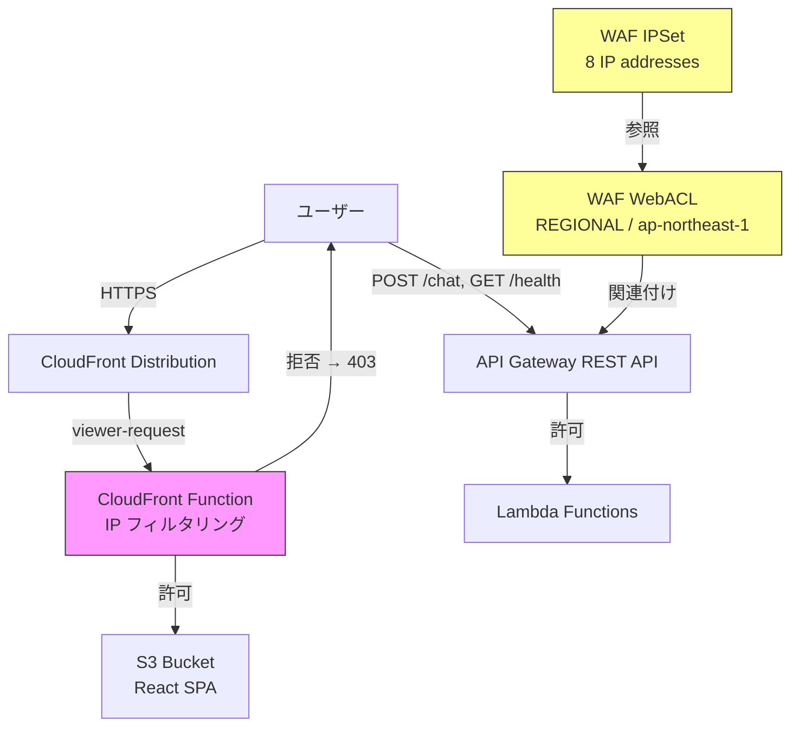
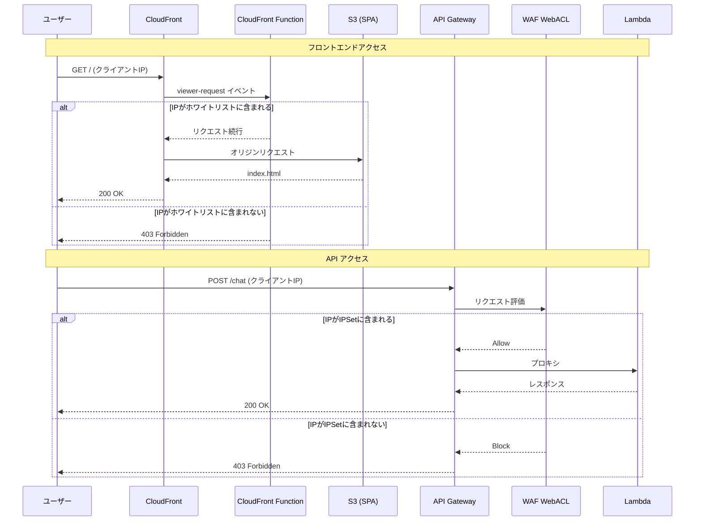

# 技術設計

## 概要

本設計では、confee の CloudFront および API Gateway に対して IP ベースのアクセス制御を実装する。すべてのリソースを ap-northeast-1 リージョンで管理し、クロスリージョンの複雑性を排除する方針に基づき、以下の2つのメカニズムを組み合わせる:

- **CloudFront**: CloudFront Function による viewer-request レベルの IP フィルタリング
- **API Gateway**: AWS WAF（REGIONAL スコープ、ap-northeast-1）による IP ホワイトリスト

IP アドレスリストは CDK コード内の定数として一元管理し、CloudFront Function のコード生成と WAF IPSet の両方に反映する。

## 要件トレーサビリティ

| 設計コンポーネント | 対応要件 |
|---|---|
| IPアドレス定数定義 (`ALLOWED_IPS`) | 要件1 (1.1, 1.2), 要件6 (6.3) |
| WAF IPSet + WebACL (REGIONAL) | 要件1 (1.1-1.5) |
| CloudFront Function (IP フィルタリング) | 要件2 (2.1-2.4) |
| WAF WebACL ↔ API Gateway ステージ関連付け | 要件3 (3.1-3.4) |
| CORS 設定の厳格化 | 要件4 (4.1-4.3) |
| WAF CloudWatch メトリクス | 要件5 (5.1-5.2) |
| CDK スタック構成 | 要件6 (6.1-6.3) |

## アーキテクチャ

### 全体構成



### リクエストフロー



## コンポーネント設計

### 1. IP アドレス定数定義

`infra/lib/config/allowed-ips.ts` に IP アドレスリストを定義する。

```typescript
/**
 * IPホワイトリスト定義
 * WAF IPSet と CloudFront Function の両方で使用する
 */
export const ALLOWED_IPS: string[] = [
  "66.159.192.8",
  "66.159.192.9",
  "66.159.200.79",
  "114.141.123.64",
  "114.141.123.65",
  "137.83.216.7",
  "137.83.216.125",
  "208.127.111.180",
];

/** WAF IPSet 用の CIDR 表記 */
export const ALLOWED_IP_CIDRS: string[] = ALLOWED_IPS.map(
  (ip) => `${ip}/32`
);
```

### 2. WAF IPSet + WebACL (ConfeeApiStack に追加)

API Gateway を保護する WAF リソースを `ConfeeApiStack` 内に作成する。既存スタックに WAF リソースを追加することで、スタック数の増加を避け、API Gateway との関連付けを同一スタック内で完結させる。

```typescript
import * as wafv2 from "aws-cdk-lib/aws-wafv2";

// WAF IPSet
const ipSet = new wafv2.CfnIPSet(this, "AllowedIpSet", {
  name: "confee-allowed-ips",
  scope: "REGIONAL",
  ipAddressVersion: "IPV4",
  addresses: ALLOWED_IP_CIDRS,
});

// WAF WebACL
const webAcl = new wafv2.CfnWebACL(this, "ApiWebAcl", {
  name: "confee-api-waf",
  scope: "REGIONAL",
  defaultAction: { block: {} },
  visibilityConfig: {
    cloudWatchMetricsEnabled: true,
    metricName: "confee-api-waf",
    sampledRequestsEnabled: true,
  },
  rules: [
    {
      name: "AllowWhitelistedIPs",
      priority: 1,
      action: { allow: {} },
      statement: {
        ipSetReferenceStatement: {
          arn: ipSet.attrArn,
        },
      },
      visibilityConfig: {
        cloudWatchMetricsEnabled: true,
        metricName: "confee-allowed-ips",
        sampledRequestsEnabled: true,
      },
    },
  ],
});

// WAF WebACL → API Gateway ステージ関連付け
new wafv2.CfnWebACLAssociation(this, "ApiWafAssociation", {
  resourceArn: `arn:aws:apigateway:${this.region}::/restapis/${this.api.restApiId}/stages/${this.api.deploymentStage.stageName}`,
  webAclArn: webAcl.attrArn,
});
```

**設計判断**: WAF リソースを新規スタックではなく `ConfeeApiStack` 内に配置する理由:
- API Gateway との関連付けに `restApiId` と `stageName` が必要であり、同一スタック内の方が参照が容易
- REGIONAL スコープの WAF は API Gateway と同じリージョン (ap-northeast-1) にデプロイされるため、クロスリージョンの問題がない
- スタック数を増やさないことで運用の複雑性を抑制

### 3. CloudFront Function (ConfeeFrontendStack に追加)

CloudFront Function は viewer-request イベントで実行され、クライアント IP をホワイトリストと照合する。CDK コード内で JavaScript 関数コードを動的生成し、IP リストの一元管理を実現する。

```typescript
import * as cloudfront from "aws-cdk-lib/aws-cloudfront";

// CloudFront Function コードを動的生成
const ipListJs = JSON.stringify(ALLOWED_IPS);
const functionCode = `
function handler(event) {
  var clientIp = event.viewer.ip;
  var allowedIps = ${ipListJs};
  if (allowedIps.indexOf(clientIp) === -1) {
    return {
      statusCode: 403,
      statusDescription: 'Forbidden',
      headers: {
        'content-type': { value: 'text/plain' }
      },
      body: 'Access Denied'
    };
  }
  return event.request;
}
`;

const ipFilterFunction = new cloudfront.Function(this, "IpFilterFunction", {
  code: cloudfront.FunctionCode.fromInline(functionCode),
  runtime: cloudfront.FunctionRuntime.JS_2_0,
  comment: "IP whitelist filter for confee",
});
```

CloudFront Distribution の `defaultBehavior` に CloudFront Function を関連付ける:

```typescript
const distribution = new cloudfront.Distribution(this, "Distribution", {
  defaultBehavior: {
    origin: origins.S3BucketOrigin.withOriginAccessControl(websiteBucket),
    viewerProtocolPolicy: cloudfront.ViewerProtocolPolicy.REDIRECT_TO_HTTPS,
    functionAssociations: [
      {
        function: ipFilterFunction,
        eventType: cloudfront.FunctionEventType.VIEWER_REQUEST,
      },
    ],
  },
  // ...
});
```

**設計判断 — CloudFront errorResponses との共存**:

現在の `ConfeeFrontendStack` では、SPA ルーティングのために 403 エラーを `index.html` にリダイレクトする `errorResponses` 設定がある。CloudFront Function が 403 を返した場合、この `errorResponses` は**適用されない**。CloudFront Function は viewer-request 段階で直接レスポンスを返すため、オリジンエラーレスポンスのハンドリングをバイパスする。よって、既存の SPA ルーティングと IP フィルタリングは干渉しない。

### 4. CORS 設定の厳格化 (ConfeeApiStack 修正)

CloudFront ドメイン名を `ConfeeFrontendStack` から `ConfeeApiStack` に渡し、CORS のオリジンを制限する。

#### ConfeeFrontendStack の変更

CloudFront Distribution のドメイン名をスタック外部に公開する:

```typescript
export class ConfeeFrontendStack extends cdk.Stack {
  public readonly distributionDomainName: string;

  constructor(scope: Construct, id: string, props?: cdk.StackProps) {
    super(scope, id, props);
    // ...
    this.distributionDomainName = distribution.distributionDomainName;
  }
}
```

#### ConfeeApiStackProps の拡張

```typescript
export interface ConfeeApiStackProps extends cdk.StackProps {
  agentRuntimeArn: string;
  cloudFrontDomainName: string; // 追加
}
```

#### CORS 設定の修正

```typescript
const allowOrigin = `https://${props.cloudFrontDomainName}`;

this.api = new apigateway.RestApi(this, "ConfeeApi", {
  restApiName: "confee-api",
  defaultCorsPreflightOptions: {
    allowOrigins: [allowOrigin],
    allowMethods: apigateway.Cors.ALL_METHODS,
    allowHeaders: ["Content-Type"],
  },
});

// Gateway Responses の CORS ヘッダーも厳格化
this.api.addGatewayResponse("Default4xx", {
  type: apigateway.ResponseType.DEFAULT_4XX,
  responseHeaders: {
    "Access-Control-Allow-Origin": `'${allowOrigin}'`,
    "Access-Control-Allow-Headers": "'Content-Type'",
  },
});
this.api.addGatewayResponse("Default5xx", {
  type: apigateway.ResponseType.DEFAULT_5XX,
  responseHeaders: {
    "Access-Control-Allow-Origin": `'${allowOrigin}'`,
    "Access-Control-Allow-Headers": "'Content-Type'",
  },
});
```

#### infra.ts のデプロイ順序変更

CORS 設定に CloudFront ドメイン名が必要なため、`ConfeeFrontendStack` を先にデプロイし、その出力を `ConfeeApiStack` に渡す:

```typescript
const app = new cdk.App();

const agentCoreStack = new ConfeeAgentCoreStack(app, "ConfeeAgentCoreStack");

const frontendStack = new ConfeeFrontendStack(app, "ConfeeFrontendStack");

new ConfeeApiStack(app, "ConfeeApiStack", {
  agentRuntimeArn: agentCoreStack.agentRuntimeArn,
  cloudFrontDomainName: frontendStack.distributionDomainName,
});
```

### 5. WAF CloudWatch メトリクス

WAF WebACL の `visibilityConfig` で CloudWatch メトリクスを有効化する（上記 WAF WebACL 定義に含まれている）。追加のリソース作成は不要で、以下のメトリクスが自動的に記録される:

| メトリクス名 | 説明 |
|---|---|
| `confee-api-waf` (AllowedRequests) | 許可されたリクエスト数 |
| `confee-api-waf` (BlockedRequests) | ブロックされたリクエスト数 |
| `confee-allowed-ips` (AllowedRequests) | IP ホワイトリストルールで許可されたリクエスト数 |

メトリクス名前空間: `AWS/WAFV2`

## 変更対象ファイル

| ファイル | 変更内容 |
|---|---|
| `infra/lib/config/allowed-ips.ts` | **新規作成** — IP アドレスリスト定数 |
| `infra/lib/api-stack.ts` | WAF IPSet/WebACL 作成、WAF ↔ API Gateway 関連付け、CORS 厳格化、Props 拡張 |
| `infra/lib/frontend-stack.ts` | CloudFront Function 作成・関連付け、`distributionDomainName` 公開 |
| `infra/bin/infra.ts` | スタック依存関係変更（Frontend → Api の順序） |
| `infra/test/api-stack.test.ts` | WAF リソース、CORS 設定のテスト追加 |
| `infra/test/frontend-stack.test.ts` | CloudFront Function のテスト追加 |

## エラーハンドリング

| シナリオ | 挙動 |
|---|---|
| ホワイトリスト外 IP → CloudFront | CloudFront Function が 403 Forbidden（テキスト "Access Denied"）を返す |
| ホワイトリスト外 IP → API Gateway | WAF が 403 Forbidden を返す。Gateway Response の CORS ヘッダーが付与される |
| CloudFront Function ランタイムエラー | CloudFront はリクエストを通過させる（fail-open）。CloudFront Function のエラーログで検知 |
| WAF サービス障害 | AWS WAF の SLA に依存。WAF が利用不可の場合、API Gateway はリクエストを受け付ける（fail-open） |

## セキュリティ考慮事項

- **多層防御**: CloudFront (CloudFront Function) と API Gateway (WAF) の2層で IP フィルタリングを実施。いずれか一方が突破されても、もう一方で防御
- **CORS 厳格化**: `Access-Control-Allow-Origin` を CloudFront ドメインに限定し、ブラウザからの不正オリジンリクエストを防止
- **fail-open 特性**: CloudFront Function および WAF はいずれも障害時に fail-open となる。社内システムとしては可用性を優先し、この特性を許容する
- **IP アドレス管理**: IP リストは CDK コード内の定数として管理。変更は Git コミットとデプロイプロセスを経るため、変更履歴が追跡可能

## テスト戦略

### リスクマトリクス

| 領域 | リスク | 必須テスト | 参照要件 |
|---|---|---|---|
| IP フィルタリング（WAF） | High | CDK Assertion | 要件1, 3 |
| IP フィルタリング（CloudFront Function） | High | CDK Assertion | 要件2 |
| CORS 設定 | Medium | CDK Assertion | 要件4 |
| WAF メトリクス | Low | CDK Assertion | 要件5 |
| スタック依存関係 | Medium | CDK Synth | 要件6 |

### CDK テスト (Jest)

#### api-stack.test.ts に追加するテスト

```typescript
test("WAF IPSetが8つのIPアドレスで作成される", () => {
  template.hasResourceProperties("AWS::WAFv2::IPSet", {
    Scope: "REGIONAL",
    IPAddressVersion: "IPV4",
    Addresses: Match.arrayWith([
      "66.159.192.8/32",
      "208.127.111.180/32",
    ]),
  });
});

test("WAF WebACLのデフォルトアクションがBlockである", () => {
  template.hasResourceProperties("AWS::WAFv2::WebACL", {
    DefaultAction: { Block: {} },
    Scope: "REGIONAL",
  });
});

test("WAF WebACLがAPI Gatewayに関連付けられる", () => {
  template.resourceCountIs("AWS::WAFv2::WebACLAssociation", 1);
});

test("CORSのAllowOriginがCloudFrontドメインに設定される", () => {
  template.hasResourceProperties("AWS::ApiGateway::Method", {
    HttpMethod: "OPTIONS",
  });
});
```

#### frontend-stack.test.ts に追加するテスト

```typescript
test("CloudFront Functionが作成される", () => {
  template.resourceCountIs("AWS::CloudFront::Function", 1);
});

test("CloudFront FunctionがDistributionに関連付けられる", () => {
  template.hasResourceProperties("AWS::CloudFront::Distribution", {
    DistributionConfig: {
      DefaultCacheBehavior: Match.objectLike({
        FunctionAssociations: Match.arrayWith([
          Match.objectLike({
            EventType: "viewer-request",
          }),
        ]),
      }),
    },
  });
});
```

### CI ゲート

| ステージ | 実行テスト | 基準 |
|---|---|---|
| PR | CDK Assertion テスト（Jest） | 全テストパス |
| ステージング | `cdk synth` + CloudFormation テンプレート検証 | テンプレート生成成功 |
| デプロイ後 | 手動 IP アクセス確認 | ホワイトリスト内 IP からアクセス可能 |
