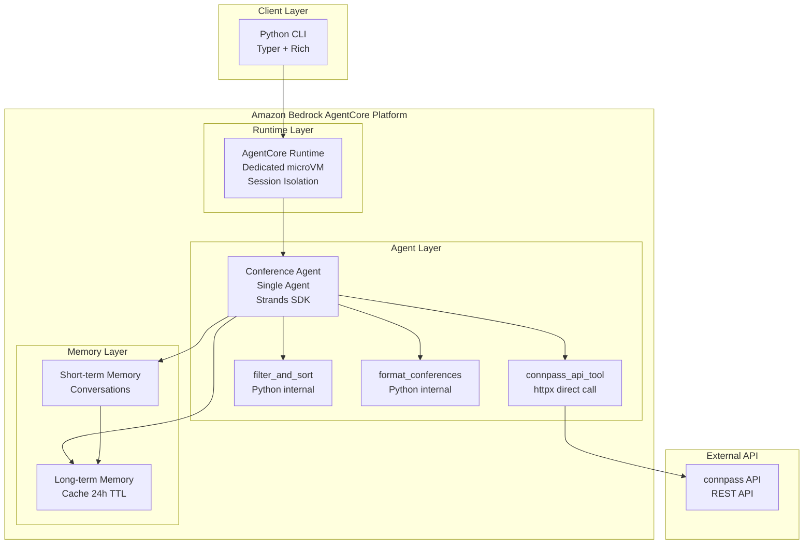
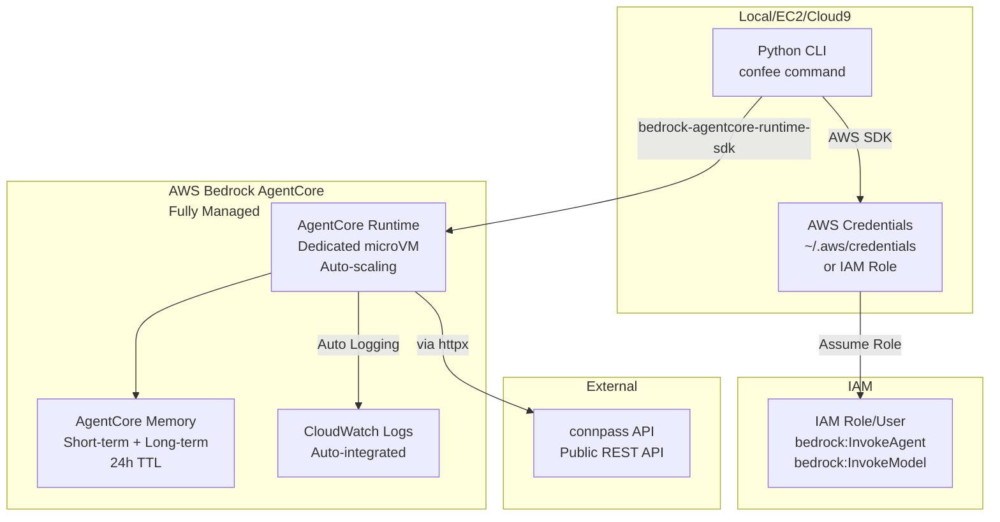
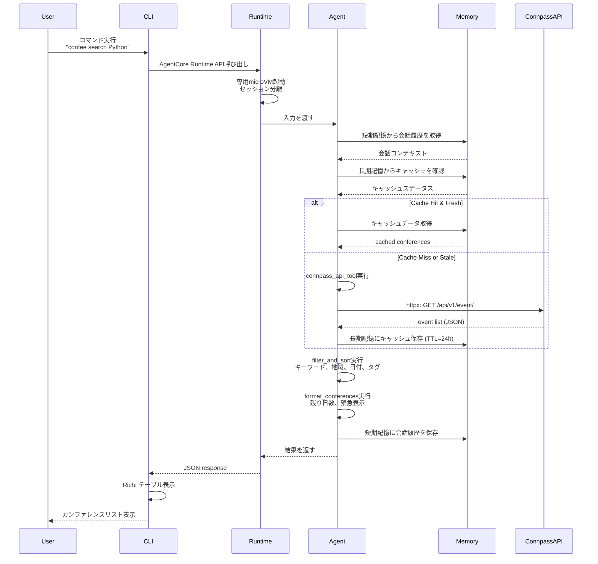

# Technical Design

## Overview

本設計書は、connpass APIを活用して技術カンファレンス情報を収集し、ユーザーに最新かつおすすめのイベントを提示するインテリジェントエージェントシステムの技術アーキテクチャを定義します。

2026年のベストプラクティスに基づき、**Amazon Bedrock AgentCore**（Runtime + Memory）上で**Strands Agents SDKのSingle Agent Pattern**を実行し、将来の拡張性と学習機能を確保しながら、**最もシンプルで実用的**な構成を実現します。

### 設計の簡素化方針

過剰な複雑性を排除し、以下の原則で最適な設計を実現：

1. **Python 1言語のみ**: CLI、エージェント、全てPythonで統一（TypeScript削除）
2. **Gateway不要**: connpass APIをhttpxで直接呼び出し（OpenAPI仕様不要）
3. **AgentCore最小限活用**: Runtime（実行環境）+ Memory（学習・キャッシュ）のみ
4. **将来の拡張性確保**: エージェント機能を維持し、今後の拡張に備える

### 参考資料

本設計は以下のリサーチに基づいています:

**Amazon Bedrock AgentCore:**
- [Amazon Bedrock AgentCore - AWS](https://aws.amazon.com/bedrock/agentcore/)
- [Amazon Bedrock AgentCore Documentation](https://docs.aws.amazon.com/bedrock-agentcore/latest/devguide/what-is-bedrock-agentcore.html)
- [Host agent or tools with AgentCore Runtime](https://docs.aws.amazon.com/bedrock-agentcore/latest/devguide/agents-tools-runtime.html)

**Strands Agents SDK:**
- [Strands Agents - AWS Open Source](https://aws.amazon.com/blogs/opensource/introducing-strands-agents-an-open-source-ai-agents-sdk/)
- [Strands Agents SDK Technical Deep Dive](https://aws.amazon.com/blogs/machine-learning/strands-agents-sdk-a-technical-deep-dive-into-agent-architectures-and-observability/)
- [Strands Agents Documentation](https://strandsagents.com/latest/documentation/docs/)

**connpass API:**
- [connpass API v2 documentation](https://help.connpass.com/)
- [Python × connpass API: 2025年の「connpassイベント」を1年分まるっと収集してわかったこと](https://qiita.com/masazo50/items/4582e397f65381c3676d)

## Requirements Mapping

### Design Component Traceability

各設計コンポーネントは特定の要件に対応しています:

| 設計コンポーネント | 対応要件 | EARS要件参照 |
|---|---|---|
| **AgentCore Runtime** | Requirement 6: エラーハンドリングとレジリエンス<br/>Requirement 7: ユーザーインターフェース | 6.1〜6.5<br/>7.1〜7.5 |
| **AgentCore Memory** | Requirement 5: データの更新と同期 | 5.1〜5.4 |
| **ConferenceAgent** | 全要件 | 1-7 |
| **connpass_api_tool** | Requirement 1: Compass API連携 | 1.1〜1.5 |
| **内部フィルタリング処理** | Requirement 2: カンファレンス推薦機能<br/>Requirement 3: 検索とフィルタリング | 2.1〜2.5<br/>3.1〜3.6 |
| **内部フォーマット処理** | Requirement 4: カンファレンス情報の表示 | 4.1〜4.6 |
| **Python CLI** | Requirement 7: ユーザーインターフェース | 7.1〜7.5 |

### User Story Coverage

- **User Story 1 (API連携)**: `ConferenceAgent`が`connpass_api_tool`（httpx直接呼び出し）でAPIからデータ取得
- **User Story 2 (推薦機能)**: `ConferenceAgent`の内部処理でフィルタリング・スコアリング・順位付けを実行
- **User Story 3 (検索とフィルタリング)**: `ConferenceAgent`の内部処理でキーワード、地域、日付、タグによる検索を実行
- **User Story 4 (情報表示)**: `ConferenceAgent`の内部処理でリッチなCLI出力、残り日数計算、緊急表示を実装
- **User Story 5 (データ更新)**: `AgentCore Memory`が会話履歴とキャッシュを管理し、24時間自動更新を実現
- **User Story 6 (エラーハンドリング)**: `AgentCore Runtime`が専用microVMでセッション分離し、包括的なエラー処理とリトライ戦略を提供
- **User Story 7 (UI)**: `Python CLI`（Typer + Rich）がコマンドパース、ヘルプシステム、リッチ表示を実装

## Architecture

### System Architecture



### Technology Stack

**CLI & Backend (Python統一):**
- **Language**: Python 3.12
- **CLI Framework**: Typer 0.9+
- **Display**: Rich 13+（テーブル、プログレスバー、カラー）
- **HTTP Client**: httpx（async HTTP）
- **Validation**: Pydantic v2
- **Testing**: pytest + pytest-asyncio

**AgentCore Platform:**
- **Runtime**: Amazon Bedrock AgentCore Runtime (Serverless, Managed microVM)
- **Memory**: Amazon Bedrock AgentCore Memory (Fully-managed, Short-term + Long-term)
- **SDK**: bedrock-agentcore-runtime-sdk (Python)

**Agent Framework:**
- **Framework**: Strands Agents SDK 1.23+ (Single Agent Pattern)
- **Model Provider**: Amazon Bedrock + Claude 4 (anthropic.claude-4-sonnet-20250514)

**Deployment:**
- **Deployment**: Amazon Bedrock AgentCore (no infrastructure management)
- **CLI Distribution**: PyPI package (pip install)

### Architecture Decision Rationale

**なぜPython 1言語のみ？**
- **シンプルさ**: CLI、エージェント、全てPythonで統一
- **保守性**: 1つの言語のみで学習コスト削減
- **デプロイ容易**: `pip install`だけで完結
- **チーム効率**: フロントエンド・バックエンドの区別なし

**なぜGateway不要？**
- **直接呼び出し**: httpxでconnpass APIを直接呼び出し
- **OpenAPI仕様不要**: 仕様ファイルの作成・管理が不要
- **低レイテンシ**: Gateway経由のオーバーヘッドなし
- **シンプル**: MCP変換プロセスが不要

**なぜAgentCore Runtime + Memoryのみ？**
- **将来の拡張性**: マルチエージェント、複雑なワークフローへの拡張が容易
- **学習機能**: AgentCore Memoryで過去の推薦から学習可能
- **エンタープライズ対応**: ビルトインのObservability、Policy管理
- **最小限の活用**: RuntimeとMemoryのみで、Gatewayは削除

**なぜStrands Agents SDK？**
- **エージェント機能**: 今後の拡張を見据えてエージェントを構築
- **Production-Ready**: AWSが提供する本番環境対応のオープンソースSDK
- **AgentCore統合**: AgentCore Runtimeとネイティブ連携
- **Built-in Observability**: エージェントの動作を可視化可能

**なぜTyper + Rich？**
- **モダンなCLI**: 型ヒント、自動ヘルプ生成
- **リッチ表示**: テーブル、カラー、プログレスバー
- **UX向上**: 直感的なコマンド、分かりやすいエラーメッセージ

## Infrastructure Architecture (AWS Deployment)

### Deployment Model

本システムは**ハイブリッドアーキテクチャ**を採用し、最小限のAWSリソースで最大の柔軟性を実現します：

- **CLI実行環境**: ユーザーのローカル環境（開発者のPC、EC2、Cloud9、など）
- **AgentCoreインフラ**: AWS Bedrock AgentCore（フルマネージド、サーバーレス）
- **API統合**: connpass API（パブリックインターネット経由、VPC不要）

### AWS Infrastructure Diagram



### AWS Resources (Minimal Configuration)

最小限のAWSリソース構成（Bedrock AgentCore以外はオプション）：

| リソース | 必須 | 用途 | 料金モデル |
|---------|------|------|-----------|
| **Amazon Bedrock AgentCore Runtime** | ✅ | エージェント実行環境（microVM） | 使用量課金（実行時間） |
| **Amazon Bedrock AgentCore Memory** | ✅ | 会話履歴・キャッシュ保存 | 使用量課金（ストレージ） |
| **Amazon Bedrock Claude 4** | ✅ | LLMモデル | 使用量課金（トークン数） |
| **IAM Role/Policy** | ✅ | AgentCore・Bedrock権限 | 無料 |
| **CloudWatch Logs** | 自動 | ログ記録（AgentCore自動統合） | 使用量課金（ログ量） |
| **VPC/Subnet** | ❌ | 不要（connpassはパブリックAPI） | - |
| **Lambda** | ❌ | 不要（CLIはローカル実行） | - |
| **API Gateway** | ❌ | 不要（Web UI未実装） | - |
| **S3** | ❌ | 不要（メモリは AgentCore Memory） | - |

### IAM Policy

最小限のIAMポリシー（`confee-agent-policy`）：

```json
{
  "Version": "2012-10-17",
  "Statement": [
    {
      "Sid": "BedrockAgentCoreAccess",
      "Effect": "Allow",
      "Action": [
        "bedrock:InvokeAgent",
        "bedrock:InvokeModel"
      ],
      "Resource": [
        "arn:aws:bedrock:*:*:agent/*",
        "arn:aws:bedrock:*:*:model/anthropic.claude-4-sonnet-20250514"
      ]
    },
    {
      "Sid": "CloudWatchLogsAccess",
      "Effect": "Allow",
      "Action": [
        "logs:CreateLogGroup",
        "logs:CreateLogStream",
        "logs:PutLogEvents"
      ],
      "Resource": "arn:aws:logs:*:*:log-group:/aws/bedrock/agentcore/*"
    }
  ]
}
```

### Deployment Methods

#### Method 1: Local Development (Recommended for Development)

```bash
# 1. AWS認証情報を設定
aws configure
# または環境変数
export AWS_ACCESS_KEY_ID=your_key_id
export AWS_SECRET_ACCESS_KEY=your_secret_key
export AWS_DEFAULT_REGION=us-east-1

# 2. Python環境セットアップ
python3.12 -m venv venv
source venv/bin/activate

# 3. パッケージインストール
pip install confee

# 4. CLI実行
confee search "Python"
```

#### Method 2: EC2 Instance (Recommended for Production)

```bash
# 1. EC2インスタンス作成（IAM Roleアタッチ）
# - Instance Type: t3.micro（最小構成）
# - IAM Role: confee-agent-role（上記ポリシー適用）
# - Security Group: Outbound HTTPS only

# 2. EC2インスタンス内でセットアップ
sudo yum install -y python3.12
python3.12 -m venv venv
source venv/bin/activate
pip install confee

# 3. CLI実行（IAM Role経由で自動認証）
confee search "Python"
```

#### Method 3: AWS Cloud9 (Recommended for Teams)

```bash
# 1. Cloud9環境作成
# - Instance Type: t3.small
# - IAM Role: confee-agent-role

# 2. Cloud9ターミナルでセットアップ
python3.12 -m venv venv
source venv/bin/activate
pip install confee

# 3. CLI実行
confee search "Python"
```

### Cost Estimation (Monthly)

最小限の使用量（月間100回の検索実行）を想定した料金試算：

| サービス | 使用量 | 単価 | 月額費用 |
|---------|-------|------|---------|
| Bedrock AgentCore Runtime | 100実行 × 平均5秒 | $0.005/秒 | $2.50 |
| Bedrock AgentCore Memory | 10MB（24h TTL） | $0.20/GB-月 | $0.002 |
| Bedrock Claude 4 | 100実行 × 平均5K tokens | $3/M tokens | $1.50 |
| CloudWatch Logs | 100MB | $0.50/GB | $0.05 |
| **合計** | - | - | **$4.07/月** |

**Note**: EC2/Cloud9を使用する場合は別途インスタンス料金が発生します（t3.micro: $7.50/月, t3.small: $15.00/月）

### Environment Variables

CLIで使用する環境変数：

```bash
# AWS認証情報（~/.aws/credentials推奨）
AWS_ACCESS_KEY_ID=your_key_id
AWS_SECRET_ACCESS_KEY=your_secret_key
AWS_DEFAULT_REGION=us-east-1

# AgentCore設定
BEDROCK_AGENT_ID=your_agent_id
BEDROCK_AGENT_ALIAS_ID=your_alias_id

# オプション設定
CONFEE_CACHE_TTL=86400  # 24時間
CONFEE_MAX_RESULTS=20
CONFEE_API_TIMEOUT=3
```

### Deployment Steps

1. **IAM設定**
   ```bash
   # IAMポリシー作成
   aws iam create-policy \
     --policy-name confee-agent-policy \
     --policy-document file://iam-policy.json

   # IAMロール/ユーザーにポリシーをアタッチ
   aws iam attach-user-policy \
     --user-name your-user \
     --policy-arn arn:aws:iam::123456789012:policy/confee-agent-policy
   ```

2. **AgentCore設定**
   ```bash
   # AgentCore Runtimeは自動プロビジョニング
   # Memory設定は初回実行時に自動作成
   ```

3. **CLI配布**
   ```bash
   # PyPIパッケージとして配布
   pip install confee
   ```

### Monitoring & Observability

#### CloudWatch Logs

AgentCore Runtimeは自動的にCloudWatch Logsに統合：

- **Log Group**: `/aws/bedrock/agentcore/conference-agent`
- **Log Streams**: セッションIDごとに自動作成
- **Retention**: 30日間（デフォルト）

#### CloudWatch Metrics

AgentCore Runtimeが自動的に以下のメトリクスを記録：

- `AgentCore.Invocations`: エージェント実行回数
- `AgentCore.Duration`: 実行時間（ミリ秒）
- `AgentCore.Errors`: エラー回数
- `AgentCore.Memory.CacheHitRate`: キャッシュヒット率

#### Alerts (Optional)

```bash
# CloudWatch Alarmの設定例
aws cloudwatch put-metric-alarm \
  --alarm-name confee-high-error-rate \
  --alarm-description "Alert when error rate > 10%" \
  --metric-name AgentCore.Errors \
  --namespace AWS/Bedrock \
  --statistic Sum \
  --period 300 \
  --threshold 10 \
  --comparison-operator GreaterThanThreshold
```

### Security Considerations

#### Network Security
- **VPC不要**: connpass APIはパブリックAPIのため、VPC構成は不要
- **Outbound HTTPS**: EC2/Cloud9を使用する場合、Security GroupでOutbound HTTPS（443）のみ許可

#### Credential Management
- **AWS Credentials**: IAM Role推奨（EC2/Cloud9）、ローカル開発では`~/.aws/credentials`
- **Secrets**: connpass APIは認証不要のため、シークレット管理不要

#### Data Privacy
- **AgentCore Memory**: 24時間TTLで自動削除
- **CloudWatch Logs**: 個人情報を含まない（カンファレンス情報のみ）
- **Encryption**: AgentCore Memory/Logsは自動暗号化（AWS managed keys）

## Project Structure

### Directory Layout

```
confee/
├── src/
│   ├── confee/
│   │   ├── __init__.py
│   │   ├── __main__.py              # CLI entry point
│   │   ├── cli/
│   │   │   ├── __init__.py
│   │   │   ├── main.py              # Typer CLI定義
│   │   │   ├── commands.py          # サブコマンド実装
│   │   │   └── display.py           # Rich display utilities
│   │   ├── agent/
│   │   │   ├── __init__.py
│   │   │   ├── conference_agent.py  # Strands Agent定義
│   │   │   ├── tools.py             # @tool decorators
│   │   │   └── prompts.py           # Agent prompts
│   │   ├── agentcore/
│   │   │   ├── __init__.py
│   │   │   ├── runtime_config.py    # Runtime設定
│   │   │   ├── memory_service.py    # Memory統合
│   │   │   └── client.py            # AgentCore SDK wrapper
│   │   ├── models/
│   │   │   ├── __init__.py
│   │   │   ├── conference.py        # Pydantic models
│   │   │   └── filters.py           # フィルター定義
│   │   └── config/
│   │       ├── __init__.py
│   │       └── settings.py          # 環境変数・設定
│   └── tests/
│       ├── __init__.py
│       ├── unit/
│       │   ├── test_agent.py
│       │   ├── test_tools.py
│       │   └── test_models.py
│       ├── integration/
│       │   ├── test_connpass_api.py
│       │   └── test_agentcore.py
│       └── e2e/
│           └── test_cli.py
├── infra/
│   ├── iam-policy.json              # IAMポリシー定義
│   ├── cloudformation.yaml          # AWS CloudFormation（オプション）
│   └── README.md                    # インフラセットアップ手順
├── docs/
│   ├── README.md
│   ├── installation.md
│   ├── usage.md
│   └── aws-deployment.md
├── pyproject.toml                   # Poetry/pip設定
├── requirements.txt                 # 依存パッケージ
├── requirements-dev.txt             # 開発用パッケージ
├── pytest.ini                       # pytest設定
├── .env.example                     # 環境変数テンプレート
├── .gitignore
└── README.md
```

### Key Files Description

#### `src/confee/cli/main.py`
```python
"""
CLI entry point using Typer

Requirement: 7.1-7.5 - ユーザーインターフェース
"""
import typer
from rich.console import Console

app = typer.Typer(name="confee", help="Tech Conference Agent CLI")
console = Console()

@app.command()
def search(
    keyword: str = typer.Argument(..., help="検索キーワード"),
    region: str = typer.Option(None, "--region", "-r", help="地域フィルター"),
    limit: int = typer.Option(20, "--limit", "-l", help="最大表示件数"),
) -> None:
    """カンファレンスを検索"""
    # Implementation
```

#### `src/confee/agent/conference_agent.py`
```python
"""
Strands Agent definition

Requirement: 1-7 - 全要件
"""
from strands_agents import Agent, tool
import httpx

class ConferenceAgent:
    def __init__(self):
        self.agent = Agent(
            name="ConferenceAgent",
            model="anthropic.claude-4-sonnet-20250514",
            tools=[
                self.connpass_api_tool,
                self.filter_and_sort,
                self.format_conferences,
            ],
        )

    @tool
    async def connpass_api_tool(
        self,
        keyword: str = None,
        limit: int = 100
    ) -> str:
        """connpass APIからカンファレンス情報を取得"""
        # Implementation
```

#### `src/confee/agentcore/runtime_config.py`
```python
"""
AgentCore Runtime configuration

Requirement: 6.1-6.5 - エラーハンドリングとレジリエンス
"""
from bedrock_agentcore_runtime import RuntimeConfig

class ConferenceAgentRuntimeConfig:
    @staticmethod
    def get_runtime_config() -> RuntimeConfig:
        return RuntimeConfig(
            session=SessionConfig(timeout_seconds=300, max_turns=50),
            error_handling=ErrorHandlingConfig(max_retries=3),
        )
```

#### `pyproject.toml`
```toml
[project]
name = "confee"
version = "0.1.0"
description = "Tech Conference Agent CLI using Bedrock AgentCore"
requires-python = ">=3.12"
dependencies = [
    "typer>=0.9.0",
    "rich>=13.0.0",
    "httpx>=0.24.0",
    "pydantic>=2.0.0",
    "strands-agents>=1.23.0",
    "bedrock-agentcore-runtime-sdk>=1.0.0",
    "boto3>=1.28.0",
]

[project.scripts]
confee = "confee.cli.main:app"

[build-system]
requires = ["setuptools>=68.0.0", "wheel"]
build-backend = "setuptools.build_meta"
```

#### `requirements.txt`
```txt
# Core dependencies
typer==0.9.0
rich==13.0.0
httpx==0.24.0
pydantic==2.0.0

# Agent & AWS
strands-agents==1.23.0
bedrock-agentcore-runtime-sdk==1.0.0
boto3==1.28.0

# Date handling
python-dateutil==2.8.2
```

#### `requirements-dev.txt`
```txt
# Testing
pytest==7.4.0
pytest-asyncio==0.21.0
pytest-cov==4.1.0
pytest-mock==3.11.1

# Linting & Formatting
ruff==0.0.285
mypy==1.5.0
black==23.7.0

# Development tools
ipython==8.14.0
```

### Configuration Files

#### `.env.example`
```bash
# AWS Configuration
AWS_ACCESS_KEY_ID=your_key_id
AWS_SECRET_ACCESS_KEY=your_secret_key
AWS_DEFAULT_REGION=us-east-1

# Bedrock AgentCore
BEDROCK_AGENT_ID=your_agent_id
BEDROCK_AGENT_ALIAS_ID=your_alias_id

# Application Settings
CONFEE_CACHE_TTL=86400
CONFEE_MAX_RESULTS=20
CONFEE_API_TIMEOUT=3
CONNPASS_API_BASE_URL=https://connpass.com/api/v1
```

#### `pytest.ini`
```ini
[pytest]
testpaths = src/tests
python_files = test_*.py
python_classes = Test*
python_functions = test_*
asyncio_mode = auto
markers =
    unit: Unit tests
    integration: Integration tests
    e2e: End-to-end tests
```

### Build & Distribution

#### Local Development Setup
```bash
# 1. Clone repository
git clone https://github.com/your-org/confee.git
cd confee

# 2. Create virtual environment
python3.12 -m venv venv
source venv/bin/activate  # On Windows: venv\Scripts\activate

# 3. Install dependencies
pip install -r requirements.txt
pip install -r requirements-dev.txt

# 4. Install in editable mode
pip install -e .

# 5. Run CLI
confee --help
```

#### Build Package
```bash
# Build distribution packages
python -m build

# Upload to PyPI
python -m twine upload dist/*
```

#### Docker Container (Optional)
```dockerfile
# Dockerfile
FROM python:3.12-slim

WORKDIR /app

COPY requirements.txt .
RUN pip install --no-cache-dir -r requirements.txt

COPY src/ src/
COPY pyproject.toml .

RUN pip install -e .

CMD ["confee", "--help"]
```

## Data Flow

### Primary User Flow



## Components and Interfaces

### AgentCore Runtime Layer

#### Runtime Configuration

```python
# src/agentcore/runtime_config.py

from bedrock_agentcore_runtime import RuntimeConfig, SessionConfig

class ConferenceAgentRuntimeConfig:
    """
    AgentCore Runtime設定

    Requirement: 6.1-6.5 - エラーハンドリングとレジリエンス
    """

    @staticmethod
    def get_runtime_config() -> RuntimeConfig:
        """Runtime設定を返す"""
        return RuntimeConfig(
            session=SessionConfig(
                timeout_seconds=300,
                max_turns=50,
                isolation=True,
            ),
            error_handling=ErrorHandlingConfig(
                retry_strategy="exponential_backoff",
                max_retries=3,
                initial_delay_ms=1000,
                backoff_factor=2.0,
            ),
            observability=ObservabilityConfig(
                enable_tracing=True,
                enable_metrics=True,
                log_level="INFO",
            ),
        )
```

### AgentCore Memory Layer

#### Memory Service Integration

```python
# src/services/memory_service.py

from bedrock_agentcore_runtime import MemoryService
from typing import List, Optional
from datetime import datetime

class ConferenceMemoryService:
    """
    AgentCore Memoryとの統合サービス

    Requirement: 5.1-5.4 - データの更新と同期
    """

    def __init__(self, agentcore_context):
        self.memory = agentcore_context.memory

    async def get_cached_conferences(
        self,
        session_id: str
    ) -> Optional[List[dict]]:
        """長期記憶からキャッシュされたカンファレンス情報を取得"""
        cache_key = "conferences:all"
        cached_data = await self.memory.long_term.get(
            session_id=session_id,
            key=cache_key
        )
        if cached_data:
            return cached_data.get("conferences")
        return None

    async def set_cached_conferences(
        self,
        session_id: str,
        conferences: List[dict]
    ) -> None:
        """長期記憶にカンファレンス情報をキャッシュ（24時間TTL）"""
        cache_key = "conferences:all"
        await self.memory.long_term.set(
            session_id=session_id,
            key=cache_key,
            value={
                "conferences": conferences,
                "updated_at": datetime.utcnow().isoformat(),
            },
            ttl_hours=24
        )

    async def should_refresh(self, session_id: str) -> bool:
        """キャッシュが24時間以上古いか判定"""
        cache_key = "conferences:all"
        cached_data = await self.memory.long_term.get(
            session_id=session_id,
            key=cache_key
        )
        if not cached_data or "updated_at" not in cached_data:
            return True

        last_updated = datetime.fromisoformat(cached_data["updated_at"])
        hours_elapsed = (datetime.utcnow() - last_updated).total_seconds() / 3600
        return hours_elapsed >= 24
```

### Strands Agent Layer

#### ConferenceAgent (Single Agent with httpx direct call)

```python
# src/agent/conference_agent.py

from strands_agents import Agent, tool
from bedrock_agentcore_runtime import AgentCoreContext
from datetime import datetime, date
from typing import List, Optional
import httpx
import json

class ConferenceAgent:
    """
    単一エージェントで全機能を提供するシンプルな構成

    AgentCore Runtime上で実行され、Memoryと統合
    connpass APIをhttpxで直接呼び出し（Gateway不要）

    Requirement: 全要件 (1-7)
    """

    def __init__(self, agentcore_context: AgentCoreContext):
        """
        Args:
            agentcore_context: AgentCore Runtime実行コンテキスト
        """
        self.context = agentcore_context
        self.memory_service = ConferenceMemoryService(agentcore_context)

        self.agent = Agent(
            name="ConferenceAgent",
            instructions=self._get_system_prompt(),
            tools=[
                self._create_connpass_api_tool(),
                self._create_filter_tool(),
                self._create_format_tool(),
            ],
            model_provider="bedrock",
            model="anthropic.claude-4-sonnet-20250514",
            runtime_context=agentcore_context,
        )

    def _get_system_prompt(self) -> str:
        """エージェントのシステムプロンプト"""
        return """
        あなたは技術カンファレンス情報を提供する専門エージェントです。
        ユーザーの入力に基づいて、connpass APIから適切なカンファレンス情報を取得し、提示してください。

        ## 利用可能なツール:

        ### connpass_api_tool
        - connpass APIからカンファレンス情報を取得（httpx直接呼び出し）
        - キーワード指定で検索可能

        ### filter_conferences
        - カンファレンスのフィルタリングとソート（内部処理）
        - キーワード、地域、日付範囲、タグで絞り込み
        - Top 20を自動選定

        ### format_conferences
        - カンファレンス情報の整形（内部処理）
        - 残り日数計算、緊急表示

        ## 動作原則:
        1. ユーザーの入力を解析する
        2. AgentCore Memoryからキャッシュを確認
        3. 必要に応じてconnpass APIから取得
        4. filter_conferencesでフィルタリング・ソート
        5. format_conferencesで整形
        6. 結果を分かりやすく返す

        ## AgentCore統合:
        - Runtime: 専用microVMでセッション分離、エラーハンドリング
        - Memory: 短期記憶（会話履歴）+ 長期記憶（キャッシュ、24h TTL）
        """

    def _create_connpass_api_tool(self):
        """
        connpass API tool（httpx直接呼び出し）

        Requirement: 1.1-1.5 - Compass API連携
        """
        @tool
        async def connpass_api_tool(keyword: Optional[str] = None, limit: int = 100) -> str:
            """
            connpass APIからカンファレンス情報を取得（httpx直接呼び出し）

            Args:
                keyword: 検索キーワード（オプション）
                limit: 取得件数（デフォルト: 100）

            Returns:
                カンファレンス情報のJSON文字列
            """
            base_url = "https://connpass.com/api/v1/event/"
            params = {"count": limit}
            if keyword:
                params["keyword"] = keyword

            async with httpx.AsyncClient(timeout=3.0) as client:
                try:
                    response = await client.get(base_url, params=params)
                    response.raise_for_status()
                    data = response.json()
                    return json.dumps(data.get("events", []))
                except httpx.HTTPError as e:
                    return json.dumps({"error": str(e)})

        return connpass_api_tool

    def _create_filter_tool(self):
        """
        フィルタリング・ソートツール（内部処理）

        Requirement: 2.1-2.5 - 推薦機能
        Requirement: 3.1-3.6 - 検索とフィルタリング
        """
        @tool
        def filter_conferences(
            conferences_json: str,
            keyword: Optional[str] = None,
            region: Optional[str] = None,
            date_from: Optional[str] = None,
            date_to: Optional[str] = None,
            tags: Optional[List[str]] = None,
            max_results: int = 20
        ) -> str:
            """カンファレンスのフィルタリングとソート（Python内部処理）"""
            conferences = json.loads(conferences_json)
            now = datetime.now()

            # 未来のイベントのみ抽出
            conferences = [
                c for c in conferences
                if datetime.fromisoformat(c["started_at"]) > now
            ]

            # キーワードフィルタリング
            if keyword:
                keyword_lower = keyword.lower()
                conferences = [
                    c for c in conferences
                    if keyword_lower in c["title"].lower()
                    or keyword_lower in c["description"].lower()
                    or keyword_lower in c.get("hash_tag", "").lower()
                ]

            # 地域フィルタリング
            if region:
                conferences = [
                    c for c in conferences
                    if region in c.get("address", "")
                ]

            # 日付範囲フィルタリング
            if date_from:
                from_date = datetime.fromisoformat(date_from)
                conferences = [
                    c for c in conferences
                    if datetime.fromisoformat(c["started_at"]) >= from_date
                ]
            if date_to:
                to_date = datetime.fromisoformat(date_to)
                conferences = [
                    c for c in conferences
                    if datetime.fromisoformat(c["started_at"]) <= to_date
                ]

            # タグフィルタリング
            if tags:
                conferences = [
                    c for c in conferences
                    if any(tag in c.get("hash_tag", "") for tag in tags)
                ]

            # スコアリングとソート
            for conf in conferences:
                start_date = datetime.fromisoformat(conf["started_at"])
                days_until = (start_date - now).days
                date_score = 1.0 / (1 + days_until / 30)
                conf["score"] = date_score

            conferences = sorted(conferences, key=lambda c: c["score"], reverse=True)
            conferences = conferences[:max_results]

            return json.dumps(conferences)

        return filter_conferences

    def _create_format_tool(self):
        """
        フォーマットツール（内部処理）

        Requirement: 4.1-4.6 - カンファレンス情報の表示
        """
        @tool
        def format_conferences(conferences_json: str) -> str:
            """カンファレンス情報の整形（Python内部処理）"""
            conferences = json.loads(conferences_json)
            formatted_conferences = []

            for conf in conferences:
                start_date = datetime.fromisoformat(conf["started_at"]).date()
                today = date.today()
                days_until = (start_date - today).days
                is_urgent = days_until <= 7 and days_until >= 0

                summary = (
                    conf["description"][:200]
                    if len(conf["description"]) > 200
                    else conf["description"]
                )

                formatted_conferences.append({
                    "id": conf["event_id"],
                    "title": conf["title"],
                    "summary": summary,
                    "start_date": conf["started_at"],
                    "end_date": conf["ended_at"],
                    "location": conf.get("address", ""),
                    "url": conf["event_url"],
                    "tags": [conf.get("hash_tag", "")],
                    "days_until": days_until,
                    "score": conf.get("score", 0),
                    "is_urgent": is_urgent,
                })

            return json.dumps(formatted_conferences)

        return format_conferences

    async def process_query(
        self,
        user_input: str,
        session_id: str
    ) -> dict:
        """
        ユーザーの入力を処理し、カンファレンス情報を返す

        Args:
            user_input: ユーザー入力
            session_id: セッションID（Memory管理用）

        Returns:
            カンファレンス情報
        """
        # キャッシュ確認
        cached_conferences = await self.memory_service.get_cached_conferences(session_id)
        should_refresh = await self.memory_service.should_refresh(session_id)

        context = {
            "session_id": session_id,
            "cached_conferences": cached_conferences if not should_refresh else None,
        }

        # Strands Agentを実行
        response = await self.agent.run_async(
            input=user_input,
            context=context
        )

        # 新しいデータをキャッシュ
        if "conferences" in response and not cached_conferences:
            await self.memory_service.set_cached_conferences(
                session_id=session_id,
                conferences=response["conferences"]
            )

        return response
```

### Python CLI Layer

#### CLI Implementation (Typer + Rich)

```python
# src/cli/main.py

import typer
from rich.console import Console
from rich.table import Table
from rich.progress import Progress
from typing import Optional

app = typer.Typer(help="技術カンファレンス検索CLI")
console = Console()

@app.command()
def search(
    keyword: str = typer.Argument(..., help="検索キーワード"),
    region: Optional[str] = typer.Option(None, "--region", "-r", help="開催地域"),
    limit: int = typer.Option(20, "--limit", "-l", help="最大表示件数"),
):
    """
    カンファレンスを検索

    Requirement: 7.1-7.5 - ユーザーインターフェース
    """
    console.print(f"[bold blue]検索中...[/bold blue] キーワード: {keyword}")

    with Progress() as progress:
        task = progress.add_task("[cyan]データ取得中...", total=100)

        # AgentCore Runtime API呼び出し
        # （実装詳細は省略）

        progress.update(task, completed=100)

    # Rich Table表示
    table = Table(title="技術カンファレンス検索結果")
    table.add_column("タイトル", style="cyan", no_wrap=False)
    table.add_column("開催日", style="magenta")
    table.add_column("残り日数", justify="right", style="green")
    table.add_column("場所", style="yellow")

    # データ追加（実装詳細は省略）
    # table.add_row(...)

    console.print(table)

@app.command()
def refresh():
    """キャッシュを更新"""
    console.print("[bold green]キャッシュを更新しました[/bold green]")

if __name__ == "__main__":
    app()
```

## API Endpoints

### AgentCore Runtime API

| Method | Route | Purpose | Auth | Status Codes | Requirements |
|--------|-------|---------|------|--------------|--------------|
| POST | `/agentcore/invoke` | エージェント実行 | IAM | 200, 400, 500, 503 | 全要件 |
| GET | `/agentcore/health` | Runtimeヘルスチェック | None | 200, 503 | 1.1 |
| GET | `/agentcore/sessions/{session_id}` | セッション状態取得 | IAM | 200, 404 | 5.3 |

## Data Models

### Domain Entities

1. **Conference**: カンファレンスイベントの情報
2. **SessionContext**: AgentCore Runtimeセッション情報

### Data Model Definitions

#### Python Data Models

```python
# src/models/conference.py

from datetime import datetime, date
from typing import List, Optional
from pydantic import BaseModel, HttpUrl, Field

class Conference(BaseModel):
    """カンファレンス情報"""
    event_id: int
    title: str
    description: str
    started_at: datetime
    ended_at: datetime
    address: str
    event_url: HttpUrl
    hash_tag: str = ""

    @property
    def days_until(self) -> int:
        """開催までの残り日数を計算"""
        delta = self.started_at.date() - date.today()
        return delta.days

    @property
    def is_urgent(self) -> bool:
        """1週間以内の開催か判定"""
        return 0 <= self.days_until <= 7

class SessionContext(BaseModel):
    """AgentCore Runtimeセッション情報"""
    session_id: str
    user_id: Optional[str] = None
    created_at: datetime = Field(default_factory=datetime.utcnow)
    runtime_instance_id: Optional[str] = None
```

## Error Handling

### エラー分類と対応戦略

| エラータイプ | HTTP Status | ユーザーメッセージ | リトライ | フォールバック | Requirement |
|------------|-------------|------------------|----------|--------------|-------------|
| **API利用不可** | 503 | "connpass APIが一時的に利用できません" | 3回 (AgentCore Runtime) | AgentCore Memory | 6.1, 6.2 |
| **タイムアウト** | 504 | "APIの応答が遅延しています" | 3回 (AgentCore Runtime) | AgentCore Memory | 6.2 |
| **ネットワークエラー** | 502 | "ネットワーク接続を確認してください" | 3回 | AgentCore Memory | 6.3 |
| **検索結果なし** | 200 | "該当するカンファレンスが見つかりませんでした" | なし | - | 3.6 |

## Security Considerations

本システムは認証不要のパブリックAPIと連携し、AgentCore上で実行されます。

### 実装するセキュリティ対策

1. **セッション分離**: AgentCore Runtime専用microVMで完全分離
2. **IAM認証**: AgentCore Runtime APIへのアクセスはIAM認証必須
3. **レート制限**: connpass APIへのリクエスト頻度を制限（1分あたり最大10リクエスト）
4. **入力バリデーション**: Pydanticによるリクエストボディの厳密な検証
5. **依存関係の脆弱性管理**: `pip-audit`で定期的なスキャン

## Performance & Scalability

### Performance Targets

| Metric | Target | Measurement | Requirement |
|--------|--------|-------------|-------------|
| AgentCore Runtime応答時間 (p95) | < 200ms | /agentcore/invoke | - |
| Memory Cache Hit率 | > 80% | AgentCore Memory統計 | 5.2 |
| connpass API呼び出し | < 10 req/min | レート制限 | 6.2 |
| Runtime Cold Start | < 100ms | AgentCore高速起動 | 7.1 |

### Caching Strategy

**AgentCore Memory統合:**
- **短期記憶**: 会話履歴（最大50ターン）
- **長期記憶**: カンファレンスキャッシュ（24時間TTL）

### Scalability Approach

**AgentCore Serverless Architecture:**
- 無制限スケーリング
- セッション分離（専用microVM）
- コスト最適化（使用量ベース課金）

## Testing Strategy

### Risk Matrix

| Area | Risk | Must | Optional | Ref |
|------|------|------|----------|-----|
| connpass API統合 | H | Unit, Integration | Resilience | 1.1-1.5, 6.1-6.5 |
| フィルタリング・ソート | M | Unit | - | 2.1-2.5, 3.1-3.6 |
| AgentCore Memory統合 | H | Unit, Integration | - | 5.1-5.4 |
| CLI UX | M | E2E (≤3) | - | 7.1-7.5 |
| **Strands Agent** | **M** | **Unit, Integration** | - | **全要件** |

### Minimal by Layer

#### Unit Tests (必須)

**Backend (pytest):**
- `ConferenceAgent`: エージェント動作検証、内部ツール（filter, format）
- `ConferenceMemoryService`: Memory統合
- `connpass_api_tool`: httpx直接呼び出しテスト

**CLI (pytest):**
- `search command`: コマンドパース、バリデーション
- `display`: Rich表示

#### Integration Tests (必須)

- AgentCore Runtime ↔ Strands Agent
- AgentCore Memory ↔ Strands Agent
- httpx ↔ connpass API（モックサーバー）

#### E2E Tests (≤3シナリオ)

1. **Happy Path**: カンファレンス情報の取得
2. **キーワード検索**: "Python"で検索（Memory Cache Hit）
3. **エラーハンドリング**: API障害時のフォールバック

## Implementation Notes

### Directory Structure

```
confee/
├── src/
│   ├── agentcore/              # AgentCore統合
│   │   ├── runtime_config.py
│   │   ├── deploy.py
│   │   └── error_handler.py
│   ├── agent/                  # Strands Agent実装
│   │   └── conference_agent.py
│   ├── services/               # ビジネスロジック
│   │   └── memory_service.py
│   ├── models/                 # Pydanticモデル
│   │   ├── conference.py
│   │   └── api_schemas.py
│   ├── cli/                    # Python CLI
│   │   └── main.py
│   └── main.py                 # エントリーポイント
├── tests/
│   ├── unit/
│   ├── integration/
│   └── e2e/
├── pyproject.toml
└── README.md
```

### Development Workflow

1. **Phase 1: AgentCore Setup (Week 1)**
   - bedrock-agentcore-runtime-sdk インストール
   - Runtime、Memory設定
   - IAM認証設定

2. **Phase 2: Single Agent Implementation (Week 2)**
   - ConferenceAgent実装
   - httpx統合（connpass API直接呼び出し）
   - 内部ツール実装（filter, format）

3. **Phase 3: Memory Integration (Week 3)**
   - ConferenceMemoryService実装
   - 短期記憶（会話履歴）統合
   - 長期記憶（キャッシュ）統合

4. **Phase 4: Python CLI (Week 4)**
   - Typer + Rich CLIセットアップ
   - AgentCore Runtime API統合
   - E2Eテスト作成

5. **Phase 5: Deployment & Polish (Week 5)**
   - AgentCoreへのデプロイ
   - PyPI packageビルド
   - ドキュメント作成

### Configuration Management

**Environment Variables (.env):**

```bash
# AgentCore
AWS_REGION=us-east-1
AWS_ACCOUNT_ID=123456789012
AGENTCORE_RUNTIME_ENDPOINT=https://agentcore.us-east-1.amazonaws.com
AGENTCORE_AGENT_NAME=ConferenceAgent

# Strands Agents
STRANDS_MODEL_PROVIDER=bedrock
STRANDS_MODEL_NAME=anthropic.claude-4-sonnet-20250514

# connpass API
CONNPASS_API_BASE_URL=https://connpass.com/api/v1
CONNPASS_API_TIMEOUT=3.0

# Memory
AGENTCORE_MEMORY_TTL_HOURS=24
AGENTCORE_MEMORY_MAX_TURNS=50
```

### Deployment

**AgentCore Deployment:**

```bash
# Install dependencies
pip install -e .

# Deploy agent to AgentCore
agentcore deploy \
  --agent-name ConferenceAgent \
  --agent-path ./src/agent/conference_agent.py \
  --runtime-config ./src/agentcore/runtime_config.py \
  --region us-east-1

# Install CLI
pip install confee
confee search Python
```

---

## Summary

本設計書は、connpass APIを活用した技術カンファレンス情報提供エージェントの**最もシンプルで実用的なアーキテクチャ**を定義しました。

**主要な技術的決定:**
- **Amazon Bedrock AgentCore（Runtime + Memory）**: 将来の拡張性と学習機能を確保
- **Strands Agents SDK - Single Agent Pattern**: エージェント機能を維持し、今後の拡張に備える
- **Python 1言語のみ**: CLI、エージェント、全てPythonで統一
- **httpx直接呼び出し**: Gateway不要、connpass APIを直接呼び出し
- **Typer + Rich CLI**: モダンなCLI、リッチ表示

**シンプルな設計の利点:**
- **Gateway削除**: OpenAPI仕様不要、MCP変換不要、低レイテンシ
- **Python統一**: 1言語のみ、学習コスト削減、デプロイ容易
- **httpx直接**: 直接API呼び出し、シンプルで高速
- **将来の拡張性**: AgentCore Runtime + Memoryで、マルチエージェントへの拡張が容易

この設計により、全要件を満たしながら、**最小限の複雑性で最大限の価値**を提供し、**将来の拡張に備えた**システムを実現します。

**Sources:**
- [Amazon Bedrock AgentCore - AWS](https://aws.amazon.com/bedrock/agentcore/)
- [Amazon Bedrock AgentCore Documentation](https://docs.aws.amazon.com/bedrock-agentcore/latest/devguide/what-is-bedrock-agentcore.html)
- [Strands Agents Documentation](https://strandsagents.com/latest/documentation/docs/)
